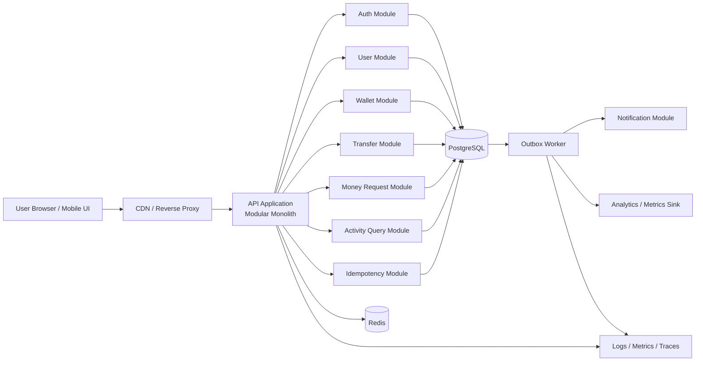

# IMPLEMENTATION_GUIDE.md

# Money Movement Application — Technical Implementation Guide

## 0. Implementation Philosophy

This guide converts the PRD into a concrete build plan suitable for an AI coding agent or engineering team.

The recommended architecture is a **modular monolith** backed by PostgreSQL, with clear module boundaries and optional asynchronous workers.

Why this architecture:

- Money movement requires strong transactional consistency.
- A single relational database makes atomic balance movement straightforward.
- A modular monolith is simpler to reason about and defend than premature microservices.
- It can still scale horizontally at the API layer.
- Clear domain modules can later be extracted if scale or organization size demands it.
- The hackathon rules explicitly value simplicity, maintainability, scalability, concurrency handling, code structure, and the ability to explain architectural decisions.

Recommended initial stack:

- **Frontend:** Next.js + TypeScript
- **Backend:** NestJS + TypeScript
- **Database:** PostgreSQL
- **ORM/query layer:** Prisma, Drizzle, TypeORM, or direct SQL; for critical wallet-locking paths, explicit SQL is acceptable and often preferable
- **Cache / rate limit / transient state:** Redis
- **Background jobs:** BullMQ or equivalent
- **Authentication:** Secure cookie session or JWT access + refresh token model
- **Validation:** Zod / class-validator
- **Observability:** OpenTelemetry-compatible logs/metrics/traces
- **Containerization:** Docker Compose for local development

The design is language/framework agnostic in principle. Preserve the domain guarantees if another stack is chosen.

---

# 1. High-Level Technical Architecture & System Design

## 1.1 Logical Components

### Frontend

Responsibilities:

- Authentication UI
- Dashboard
- Recipient search
- Send/request flows
- Activity and detail screens
- Request accept/decline/cancel actions
- Idempotency key generation for user-initiated writes
- Explicit loading/error/uncertain-result UI states

### API Application

Responsibilities:

- Authentication and authorization
- Input validation
- Domain orchestration
- Transaction boundaries
- Wallet locking
- Transfer and request state transitions
- Idempotency
- History queries
- Audit context
- Publishing outbox events

### PostgreSQL

Source of truth for:

- Users
- Wallets
- Transfers
- Money requests
- Ledger entries
- Idempotency records
- Outbox events
- Audit records

### Redis

Non-authoritative support for:

- Rate limiting
- Optional session storage
- Short-lived cached lookups
- Background worker queue coordination

Redis must **never** be required to reconstruct a balance.

### Background Worker

Responsibilities:

- Process outbox events
- Create notifications
- Dispatch optional email/push
- Analytics forwarding
- Request expiration job
- Retry non-financial side effects

### Observability

- Structured logs
- Metrics
- Distributed traces
- Error monitoring

---

## 1.2 Mermaid.js Data Flow



---

## 1.3 Recommended Domain Module Boundaries

```text
src/
  auth/
  users/
  wallets/
  transfers/
  money-requests/
  ledger/
  idempotency/
  activity/
  notifications/
  outbox/
  audit/
  common/
```

### Rule

The `transfers` module is the only module allowed to orchestrate direct balance movement.

The `money-requests` module must call the transfer domain service when accepting a request; it must not reimplement debit/credit logic.

---

## 1.4 Money Movement Transaction Strategy

Use a PostgreSQL database transaction with row-level locking.

### Direct transfer algorithm

1. Validate authenticated sender.
2. Validate recipient and amount.
3. Resolve idempotency key.
4. Begin DB transaction.
5. Load sender and receiver wallets.
6. Lock both wallet rows using `SELECT ... FOR UPDATE`.
7. Lock in deterministic order by wallet ID to reduce deadlock risk.
8. Revalidate:
   - active accounts
   - active wallets
   - sender != receiver
   - amount > 0
   - sufficient balance
9. Create transfer record.
10. Insert debit ledger entry.
11. Insert credit ledger entry.
12. Update both wallet balances.
13. Mark transfer `SUCCEEDED`.
14. Insert outbox event.
15. Persist idempotency response.
16. Commit.
17. Return canonical response.

### Why row locking

Without locking:

- Balance = 100
- Request A checks 100 and sends 80
- Request B checks 100 and sends 80
- Both could pass before either updates
- Balance can become logically invalid

With row locking, one transaction waits, then re-checks the updated balance.

---

## 1.5 Deadlock Avoidance

When locking multiple wallet rows:

```text
lower_wallet_id first
higher_wallet_id second
```

Every transfer path must use the same ordering.

If PostgreSQL reports a deadlock or serialization failure:

- rollback
- retry server-side a small bounded number of times
- preserve the same idempotency context

---

## 1.6 Idempotency Strategy

### Header

```http
Idempotency-Key: <UUIDv4-or-UUIDv7>
```

### Storage key

Uniqueness boundary:

```text
(actor_user_id, route_key, idempotency_key)
```

### Stored fields

- request hash
- HTTP status
- canonical response body
- resource ID
- created time
- expiry time

### Behavior

If key does not exist:

- reserve/create record
- process request

If key exists and request hash matches:

- return original response

If key exists and hash differs:

- return `409 IDEMPOTENCY_KEY_REUSED`

### Important

Do not implement idempotency only in Redis. Financial correctness requires durable idempotency state in PostgreSQL.

---

# 2. Data Model & Database Schema Changes

## 2.1 Conventions

- Primary keys: UUIDv7 preferred
- Timestamps: `TIMESTAMPTZ`
- Money: `BIGINT` integer minor units
- Currency: fixed `CHAR(3)` or enum; MVP `BDT`
- Soft delete only where needed; never delete ledger records
- Every high-volume list query must have supporting indexes
- Foreign keys enabled

---

## 2.2 `users`

```sql
CREATE TABLE users (
    id UUID PRIMARY KEY,
    email CITEXT UNIQUE NOT NULL,
    phone VARCHAR(32) UNIQUE,
    username CITEXT UNIQUE,
    display_name VARCHAR(120) NOT NULL,
    password_hash TEXT NOT NULL,
    status VARCHAR(16) NOT NULL
        CHECK (status IN ('ACTIVE', 'SUSPENDED', 'CLOSED')),
    created_at TIMESTAMPTZ NOT NULL DEFAULT now(),
    updated_at TIMESTAMPTZ NOT NULL DEFAULT now()
);
```

### Indexes

- unique email
- unique phone where non-null
- unique username where non-null
- search indexes based on chosen discovery fields

---

## 2.3 `wallets`

```sql
CREATE TABLE wallets (
    id UUID PRIMARY KEY,
    user_id UUID NOT NULL UNIQUE REFERENCES users(id),
    currency CHAR(3) NOT NULL DEFAULT 'BDT',
    balance_minor BIGINT NOT NULL,
    version BIGINT NOT NULL DEFAULT 0,
    status VARCHAR(16) NOT NULL
        CHECK (status IN ('ACTIVE', 'FROZEN', 'CLOSED')),
    created_at TIMESTAMPTZ NOT NULL DEFAULT now(),
    updated_at TIMESTAMPTZ NOT NULL DEFAULT now(),
    CHECK (balance_minor >= 0)
);
```

### Important

The `CHECK (balance_minor >= 0)` is a last-line database guard, not a substitute for business validation.

---

## 2.4 `transfers`

```sql
CREATE TABLE transfers (
    id UUID PRIMARY KEY,
    sender_user_id UUID NOT NULL REFERENCES users(id),
    receiver_user_id UUID NOT NULL REFERENCES users(id),
    sender_wallet_id UUID NOT NULL REFERENCES wallets(id),
    receiver_wallet_id UUID NOT NULL REFERENCES wallets(id),
    amount_minor BIGINT NOT NULL CHECK (amount_minor > 0),
    currency CHAR(3) NOT NULL,
    status VARCHAR(16) NOT NULL
        CHECK (status IN ('PENDING', 'SUCCEEDED', 'FAILED')),
    note VARCHAR(280),
    source_type VARCHAR(24) NOT NULL
        CHECK (source_type IN ('DIRECT', 'MONEY_REQUEST')),
    source_request_id UUID,
    failure_code VARCHAR(64),
    created_at TIMESTAMPTZ NOT NULL DEFAULT now(),
    completed_at TIMESTAMPTZ,
    CHECK (sender_user_id <> receiver_user_id)
);
```

### Indexes

```sql
CREATE INDEX idx_transfers_sender_created
ON transfers(sender_user_id, created_at DESC, id DESC);

CREATE INDEX idx_transfers_receiver_created
ON transfers(receiver_user_id, created_at DESC, id DESC);

CREATE INDEX idx_transfers_request
ON transfers(source_request_id)
WHERE source_request_id IS NOT NULL;
```

---

## 2.5 `ledger_entries`

```sql
CREATE TABLE ledger_entries (
    id UUID PRIMARY KEY,
    transfer_id UUID NOT NULL REFERENCES transfers(id),
    wallet_id UUID NOT NULL REFERENCES wallets(id),
    direction VARCHAR(8) NOT NULL
        CHECK (direction IN ('DEBIT', 'CREDIT')),
    amount_minor BIGINT NOT NULL CHECK (amount_minor > 0),
    signed_amount_minor BIGINT NOT NULL,
    currency CHAR(3) NOT NULL,
    balance_after_minor BIGINT NOT NULL,
    created_at TIMESTAMPTZ NOT NULL DEFAULT now()
);
```

### Ledger validation conventions

For debit:

```text
signed_amount_minor = -amount_minor
```

For credit:

```text
signed_amount_minor = +amount_minor
```

### Indexes

```sql
CREATE INDEX idx_ledger_wallet_created
ON ledger_entries(wallet_id, created_at DESC, id DESC);

CREATE INDEX idx_ledger_transfer
ON ledger_entries(transfer_id);
```

### Recommended invariant test

For each successful transfer:

```sql
SELECT SUM(signed_amount_minor)
FROM ledger_entries
WHERE transfer_id = :transfer_id;
```

Expected = `0`.

---

## 2.6 `money_requests`

```sql
CREATE TABLE money_requests (
    id UUID PRIMARY KEY,
    requester_user_id UUID NOT NULL REFERENCES users(id),
    payer_user_id UUID NOT NULL REFERENCES users(id),
    amount_minor BIGINT NOT NULL CHECK (amount_minor > 0),
    currency CHAR(3) NOT NULL DEFAULT 'BDT',
    note VARCHAR(280),
    status VARCHAR(16) NOT NULL
        CHECK (status IN ('PENDING', 'ACCEPTED', 'DECLINED', 'CANCELLED', 'EXPIRED')),
    accepted_transfer_id UUID REFERENCES transfers(id),
    expires_at TIMESTAMPTZ,
    created_at TIMESTAMPTZ NOT NULL DEFAULT now(),
    updated_at TIMESTAMPTZ NOT NULL DEFAULT now(),
    resolved_at TIMESTAMPTZ,
    CHECK (requester_user_id <> payer_user_id)
);
```

### Indexes

```sql
CREATE INDEX idx_money_requests_payer_status_created
ON money_requests(payer_user_id, status, created_at DESC);

CREATE INDEX idx_money_requests_requester_status_created
ON money_requests(requester_user_id, status, created_at DESC);
```

---

## 2.7 `idempotency_records`

```sql
CREATE TABLE idempotency_records (
    id UUID PRIMARY KEY,
    actor_user_id UUID NOT NULL REFERENCES users(id),
    route_key VARCHAR(80) NOT NULL,
    idempotency_key VARCHAR(128) NOT NULL,
    request_hash CHAR(64) NOT NULL,
    state VARCHAR(16) NOT NULL
        CHECK (state IN ('PROCESSING', 'COMPLETED', 'FAILED')),
    response_status INT,
    response_body JSONB,
    resource_type VARCHAR(32),
    resource_id UUID,
    created_at TIMESTAMPTZ NOT NULL DEFAULT now(),
    expires_at TIMESTAMPTZ NOT NULL,
    UNIQUE(actor_user_id, route_key, idempotency_key)
);
```

---

## 2.8 `outbox_events`

```sql
CREATE TABLE outbox_events (
    id UUID PRIMARY KEY,
    aggregate_type VARCHAR(32) NOT NULL,
    aggregate_id UUID NOT NULL,
    event_type VARCHAR(80) NOT NULL,
    payload JSONB NOT NULL,
    occurred_at TIMESTAMPTZ NOT NULL DEFAULT now(),
    processed_at TIMESTAMPTZ,
    attempt_count INT NOT NULL DEFAULT 0,
    last_error TEXT
);
```

### Index

```sql
CREATE INDEX idx_outbox_unprocessed
ON outbox_events(occurred_at)
WHERE processed_at IS NULL;
```

---

## 2.9 `notifications`

```sql
CREATE TABLE notifications (
    id UUID PRIMARY KEY,
    user_id UUID NOT NULL REFERENCES users(id),
    type VARCHAR(64) NOT NULL,
    title VARCHAR(160) NOT NULL,
    body VARCHAR(500) NOT NULL,
    resource_type VARCHAR(32),
    resource_id UUID,
    read_at TIMESTAMPTZ,
    created_at TIMESTAMPTZ NOT NULL DEFAULT now()
);
```

---

## 2.10 `audit_events`

```sql
CREATE TABLE audit_events (
    id UUID PRIMARY KEY,
    actor_user_id UUID REFERENCES users(id),
    action VARCHAR(80) NOT NULL,
    resource_type VARCHAR(32) NOT NULL,
    resource_id UUID,
    request_id UUID,
    metadata JSONB,
    created_at TIMESTAMPTZ NOT NULL DEFAULT now()
);
```

Do not put raw passwords, auth tokens, or secret credentials in `metadata`.

---

# 3. API / Interface Specifications

## 3.1 API Conventions

Base path:

```text
/api/v1
```

Authentication:

- `Authorization: Bearer <token>` or secure cookie session

Headers for state-changing money operations:

```http
Idempotency-Key: <unique-client-key>
Content-Type: application/json
```

Response envelope:

```json
{
  "data": {},
  "meta": {},
  "requestId": "uuid"
}
```

Error envelope:

```json
{
  "error": {
    "code": "INSUFFICIENT_BALANCE",
    "message": "Insufficient balance for this transfer.",
    "details": {}
  },
  "requestId": "uuid"
}
```

Never expose stack traces to clients.

---

## 3.2 Error Code Catalog

| HTTP | Code                       | Meaning                              |
| ---: | -------------------------- | ------------------------------------ |
|  400 | `VALIDATION_ERROR`         | Invalid request body                 |
|  401 | `UNAUTHENTICATED`          | Authentication required              |
|  403 | `FORBIDDEN`                | Authenticated but unauthorized       |
|  404 | `USER_NOT_FOUND`           | Recipient/payer unavailable          |
|  404 | `TRANSFER_NOT_FOUND`       | Transfer unavailable                 |
|  404 | `MONEY_REQUEST_NOT_FOUND`  | Request unavailable                  |
|  409 | `INSUFFICIENT_BALANCE`     | Not enough spendable balance         |
|  409 | `REQUEST_ALREADY_RESOLVED` | Request no longer pending            |
|  409 | `IDEMPOTENCY_KEY_REUSED`   | Same key used with different payload |
|  409 | `WALLET_UNAVAILABLE`       | Wallet frozen/closed                 |
|  422 | `INVALID_TRANSFER`         | Domain rule violation                |
|  429 | `RATE_LIMITED`             | Too many requests                    |
|  500 | `INTERNAL_ERROR`           | Unexpected server error              |
|  503 | `SERVICE_UNAVAILABLE`      | Temporary outage                     |

---

## 3.3 Authentication APIs

### `POST /api/v1/auth/register`

Request:

```json
{
  "email": "user@example.com",
  "password": "strong-password",
  "displayName": "User Name"
}
```

Response:

```json
{
  "data": {
    "user": {
      "id": "uuid",
      "email": "user@example.com",
      "displayName": "User Name"
    },
    "wallet": {
      "currency": "BDT",
      "balanceMinor": 10000000
    }
  },
  "requestId": "uuid"
}
```

User creation + wallet creation + initial simulated funding must be atomic.

---

### `POST /api/v1/auth/login`

Request:

```json
{
  "email": "user@example.com",
  "password": "password"
}
```

Response:

- authenticated session or token pair

---

### `POST /api/v1/auth/logout`

Invalidates session/refresh token as appropriate.

---

## 3.4 User Search

### `GET /api/v1/users/search?q=<query>&cursor=<cursor>&limit=20`

Response:

```json
{
  "data": [
    {
      "id": "uuid",
      "displayName": "Nabila",
      "username": "nabila",
      "maskedEmail": "n***@example.com"
    }
  ],
  "meta": {
    "nextCursor": "opaque-or-null"
  }
}
```

Do not expose wallet balance of other users.

---

## 3.5 Wallet API

### `GET /api/v1/wallet`

Response:

```json
{
  "data": {
    "walletId": "uuid",
    "currency": "BDT",
    "balanceMinor": 9750000,
    "status": "ACTIVE"
  },
  "requestId": "uuid"
}
```

---

## 3.6 Create Direct Transfer

### `POST /api/v1/transfers`

Headers:

```http
Idempotency-Key: 0195...
```

Request:

```json
{
  "receiverUserId": "uuid",
  "amountMinor": 250000,
  "currency": "BDT",
  "note": "Dinner"
}
```

Success:

```json
{
  "data": {
    "transferId": "uuid",
    "status": "SUCCEEDED",
    "senderUserId": "uuid",
    "receiverUserId": "uuid",
    "amountMinor": 250000,
    "currency": "BDT",
    "note": "Dinner",
    "createdAt": "2026-08-29T09:45:00+06:00",
    "completedAt": "2026-08-29T09:45:00+06:00",
    "senderBalanceAfterMinor": 9750000
  },
  "requestId": "uuid"
}
```

### Server pseudocode

```ts
async function createTransfer(command, actor, idemKey) {
  return db.transaction(async (tx) => {
    const idem = await idempotency.beginOrReplay(tx, actor.id, "POST:/transfers", idemKey, command);

    if (idem.isReplay) return idem.response;

    const walletIds = await resolveWalletIds(tx, actor.id, command.receiverUserId);
    const [firstId, secondId] = sort(walletIds);

    await lockWallet(tx, firstId);
    await lockWallet(tx, secondId);

    const sender = await getSenderWallet(tx, actor.id);
    const receiver = await getReceiverWallet(tx, command.receiverUserId);

    validateTransfer(sender, receiver, command);

    const transfer = await insertPendingTransfer(tx, ...);

    await insertLedgerDebit(tx, ...);
    await insertLedgerCredit(tx, ...);

    await updateSenderBalance(tx, ...);
    await updateReceiverBalance(tx, ...);

    await markTransferSucceeded(tx, transfer.id);
    await insertOutboxEvent(tx, ...);

    const response = buildTransferResponse(...);
    await idempotency.complete(tx, idem.id, response);

    return response;
  });
}
```

---

## 3.7 Get Transfer

### `GET /api/v1/transfers/:transferId`

Authorization:

- requester must be sender or receiver

Response:

- canonical transfer details

---

## 3.8 Activity Feed

### `GET /api/v1/activity?cursor=<cursor>&limit=20&type=<optional>`

Recommended implementation:

- query transfer participation and request participation
- normalize to a read DTO
- order by `(created_at DESC, id DESC)`
- use cursor pagination, not `OFFSET` at high scale

Response:

```json
{
  "data": [
    {
      "activityId": "transfer:uuid",
      "type": "TRANSFER",
      "direction": "OUT",
      "amountMinor": 250000,
      "currency": "BDT",
      "status": "SUCCEEDED",
      "counterparty": {
        "userId": "uuid",
        "displayName": "Nabila"
      },
      "createdAt": "..."
    }
  ],
  "meta": {
    "nextCursor": "opaque-or-null"
  }
}
```

---

## 3.9 Create Money Request

### `POST /api/v1/money-requests`

Headers:

```http
Idempotency-Key: <uuid>
```

Request:

```json
{
  "payerUserId": "uuid",
  "amountMinor": 120000,
  "currency": "BDT",
  "note": "Lunch",
  "expiresAt": null
}
```

Response:

```json
{
  "data": {
    "requestId": "uuid",
    "status": "PENDING",
    "requesterUserId": "uuid",
    "payerUserId": "uuid",
    "amountMinor": 120000,
    "currency": "BDT",
    "createdAt": "..."
  },
  "requestId": "uuid"
}
```

---

## 3.10 List Incoming Requests

### `GET /api/v1/money-requests/incoming?status=PENDING&cursor=...`

---

## 3.11 List Sent Requests

### `GET /api/v1/money-requests/outgoing?status=PENDING&cursor=...`

---

## 3.12 Accept Money Request

### `POST /api/v1/money-requests/:id/accept`

Headers:

```http
Idempotency-Key: <uuid>
```

Request:

```json
{}
```

### Required transaction behavior

Inside one DB transaction:

1. Lock money request row `FOR UPDATE`.
2. Verify actor is payer.
3. Verify request is `PENDING`.
4. Verify not expired.
5. Lock payer and requester wallets deterministically.
6. Re-check payer balance.
7. Create linked transfer.
8. Write ledger entries.
9. Update balances.
10. Mark transfer `SUCCEEDED`.
11. Set request `ACCEPTED`.
12. Set `accepted_transfer_id`.
13. Persist outbox event.
14. Persist idempotency response.
15. Commit.

---

## 3.13 Decline Request

### `POST /api/v1/money-requests/:id/decline`

Must lock request row and enforce pending state.

---

## 3.14 Cancel Request

### `POST /api/v1/money-requests/:id/cancel`

Only requester may cancel pending request.

---

## 3.15 Notifications

### `GET /api/v1/notifications?cursor=...`

### `POST /api/v1/notifications/:id/read`

Notifications are not part of financial correctness.

---

# 4. Sequenced Milestone Breakdown

## Milestone 0 — Repository & Engineering Foundation

### Tasks

- Create monorepo or clearly separated frontend/backend repositories.
- Configure TypeScript strict mode.
- Configure linting and formatting.
- Configure unit-test framework.
- Create Docker Compose for PostgreSQL and Redis.
- Configure environment validation.
- Add structured request IDs.
- Add centralized error handling.
- Add database migration system.
- Add CI pipeline:
  - lint
  - typecheck
  - unit tests
  - integration tests
  - migration validation
- Write architecture decision record for modular monolith.

### Exit criteria

- App boots locally from documented commands.
- CI green.
- Database can migrate from zero.
- Health endpoint works.

---

## Milestone 1 — Authentication + User + Wallet

### Tasks

- Implement user schema.
- Implement wallet schema.
- Implement registration.
- Atomic user + wallet creation.
- Configurable initial fake balance.
- Implement login/logout.
- Auth middleware.
- Current-user endpoint.
- Wallet balance endpoint.
- Basic dashboard UI.

### Tests

- duplicate account rejection
- user+wallet atomicity
- password hashing
- suspended user behavior
- balance returned correctly

### Exit criteria

A new user can register, log in, and see simulated balance.

---

## Milestone 2 — User Discovery

### Tasks

- Search endpoint.
- Normalize searchable fields.
- Mask sensitive fields.
- Add indexes.
- Recipient search UI.
- Exclude self.
- Rate limit search.

### Tests

- exact search
- partial search
- self exclusion
- pagination
- authorization

### Exit criteria

User can safely choose another registered user.

---

## Milestone 3 — Transfer Domain Core

### Tasks

- Transfer table.
- Ledger table.
- Idempotency table.
- Transfer service.
- Deterministic wallet locking.
- Balance updates.
- Ledger writes.
- Transfer receipt API.
- Direct send UI.
- Review/confirm screen.
- Success receipt screen.

### Mandatory automated tests

- happy path
- amount zero
- negative amount
- self-transfer
- insufficient balance
- frozen wallet
- duplicate idempotency replay
- same key/different payload conflict
- double-click equivalent test
- concurrent overspend test
- server exception rollback
- ledger sum = zero
- balance after transfer correct

### Exit criteria

Money can be sent safely and exactly once.

---

## Milestone 4 — Request Money

### Tasks

- Money request schema.
- Create request.
- Incoming/outgoing request list.
- Request detail.
- Accept.
- Decline.
- Cancel.
- Link accepted request to transfer.
- UI surfaces.

### Mandatory automated tests

- create request does not move balance
- only payer accepts/declines
- only requester cancels
- accept creates exactly one transfer
- repeated accept does not duplicate
- concurrent accept race
- accept vs decline race
- accept vs cancel race
- insufficient payer balance

### Exit criteria

Full request-and-pay flow works correctly under race conditions.

---

## Milestone 5 — Activity & Detail Views

### Tasks

- Activity aggregation query.
- Cursor pagination.
- Transfer details.
- Request details.
- Filters.
- Authorization checks.
- Dashboard recent activity.

### Tests

- correct direction
- sender sees debit
- receiver sees credit
- unrelated user gets forbidden/not found
- pagination stable under inserts

### Exit criteria

Every participant can trace their relevant activity.

---

## Milestone 6 — Outbox, Notifications & Async Work

### Tasks

- Outbox schema.
- Insert domain event in same financial DB transaction.
- Worker polls or claims events.
- In-app notification generation.
- Retry with backoff.
- Dead-letter handling or failure tracking.
- Optional email/push adapter.

### Tests

- transfer succeeds if notification worker is down
- outbox event eventually processes
- duplicate worker delivery remains safe
- retry increments attempt count

### Exit criteria

Side effects are reliable but decoupled from money correctness.

---

## Milestone 7 — Observability & Audit

### Tasks

- Request correlation IDs.
- Structured JSON logging.
- Metrics:
  - transfer success/failure
  - DB transaction duration
  - lock wait
  - idempotency replay count
  - insufficient balance count
  - outbox lag
- Audit event logging.
- Error monitoring.
- Dashboard for core SLOs.

### Exit criteria

A developer can investigate a failed or disputed transaction from IDs and logs without editing the database.

---

## Milestone 8 — Security Hardening

### Tasks

- Password policy.
- Rate limits.
- Secure headers.
- CSRF protection if cookie auth.
- CORS allowlist.
- XSS-safe rendering.
- Input size limits.
- SQL injection protection.
- Secret management.
- Refresh/session revocation.
- Authorization tests.
- Dependency vulnerability scanning.

### Exit criteria

Security test suite passes and sensitive data is absent from logs.

---

## Milestone 9 — Load, Concurrency & Failure Testing

### Tasks

- Load test read-heavy endpoints.
- Load test transfers.
- Concurrency stress same-wallet sends.
- Database connection pool tuning.
- Query-plan review.
- Chaos tests:
  - worker offline
  - Redis offline
  - API restart during traffic
  - DB connection interruption
- Verify recovery behavior.

### Exit criteria

No negative balances, duplicate financial effects, or ledger imbalances under stress.

---

## Milestone 10 — Production Readiness

### Tasks

- Database backups.
- Restore drill.
- Migration rollback strategy.
- Secrets/environment separation.
- Health/readiness endpoints.
- Graceful shutdown.
- Deployment runbook.
- Incident runbook.
- Data retention policy.
- Audit access policy.
- Operational dashboards.
- Production configuration review.

### Exit criteria

System can be deployed, monitored, restored, and safely operated.

---

# 5. Testing & Verification Strategy

## 5.1 Test Pyramid

### Unit tests

Best for:

- validation
- state machine rules
- money formatting
- request hash generation
- authorization helpers

### Integration tests

Use real PostgreSQL container.

Best for:

- row locking
- transactions
- idempotency
- ledger consistency
- unique constraints
- state transitions

### API tests

Best for:

- endpoint contracts
- auth
- error codes
- pagination
- permission boundaries

### End-to-end tests

Best for:

- register → send → receipt
- request → accept → both balances updated
- history visibility
- duplicate submit behavior

### Load/concurrency tests

Use k6, Artillery, Gatling, Locust, or equivalent.

---

## 5.2 Acceptance Criterion Traceability

### AC-1 — No partial transfer

**Proof**

- Inject exception after debit calculation but before commit.
- Assert:
  - sender balance unchanged
  - receiver balance unchanged
  - no posted ledger entries
  - no successful transfer record

---

### AC-2 — Idempotent retry creates one effect

**Proof**
Send identical transfer request 10 times using same key.

Assert:

- one transfer ID
- sender debited once
- receiver credited once
- exactly two ledger entries
- all responses resolve to canonical original result

---

### AC-3 — Concurrent overspend prevention

Initial sender balance:

```text
৳100
```

Launch concurrently:

```text
Transfer A = ৳80
Transfer B = ৳80
```

Assert:

- exactly one succeeds
- exactly one fails `INSUFFICIENT_BALANCE`
- final sender balance = ৳20
- no negative balance

Repeat hundreds/thousands of times in stress test.

---

### AC-4 — Request accepted at most once

Create one pending request.

Launch 20 concurrent `accept` calls.

Assert:

- one linked transfer
- one request final status `ACCEPTED`
- payer debited once
- requester credited once

---

### AC-5 — Authorization boundary

User C attempts:

- read A→B transfer
- accept A/B request
- cancel A/B request

Assert:

- forbidden/not found
- no state mutation

---

### AC-6 — Balanced ledger

For every successful transfer:

```text
SUM(signed_amount_minor) = 0
```

Also verify:

```text
one DEBIT + one CREDIT
```

for current MVP transfer type.

---

### AC-7 — Notification failure isolation

Disable worker/notification subsystem.

Perform transfer.

Assert:

- transfer succeeds
- balances correct
- ledger correct
- outbox event pending
- notification processes after worker returns

---

## 5.3 Property-Based Tests

Useful invariants:

```text
balance >= 0
```

```text
successful transfer => debit + credit = 0
```

```text
request accepted => exactly one transfer
```

```text
terminal request status cannot transition again
```

```text
same idempotency key + same request => same business result
```

Generate randomized amounts, users, request orders, and concurrent actions.

---

## 5.4 Database Constraint Tests

Explicitly test:

- self-transfer constraint
- non-positive amount
- duplicate wallet per user
- duplicate idempotency tuple
- invalid status
- negative wallet balance
- foreign key integrity

Application checks are not enough; database constraints should catch impossible states.

---

## 5.5 Frontend Tests

### Component

- loading/error/empty states
- disabled submit during processing
- validation messages
- correct balance formatting

### E2E

- no duplicate submit on double click
- retry after timeout reuses idempotency key
- ambiguous result transitions to status-check behavior
- request actions update UI after backend result

---

## 5.6 Performance Tests

Targets must be tuned after measurement, but establish initial budgets:

- `GET /wallet` p95 < 250 ms
- `GET /activity` p95 < 400 ms
- `POST /transfers` p95 < 700 ms under expected normal concurrency
- lock wait p95 monitored separately
- no N+1 queries on activity or requests

The correctness guarantees must not be weakened to meet latency targets.

---

## 5.7 Security Verification

- OWASP dependency scan
- authorization matrix tests
- brute-force/rate-limit test
- CSRF test if cookie auth
- XSS tests on note/display name
- log inspection for secrets
- token expiration/revocation tests
- malformed JSON and oversized payload tests

---

# 6. Identified Technical Risks & Mitigations

## Risk 1 — Double Spending Due to Concurrency

**Impact:** Critical  
**Cause:** Two requests see the same pre-transfer balance.

**Mitigation**

- PostgreSQL transaction
- row-level wallet locks
- deterministic lock order
- sufficient-balance recheck inside lock
- DB non-negative balance constraint
- concurrency stress tests

---

## Risk 2 — Duplicate Transfer Due to Retry

**Impact:** Critical  
**Cause:** Client/proxy retries after timeout.

**Mitigation**

- mandatory idempotency key
- durable idempotency record
- request hash
- return original response on replay
- UI preserves key during retry

---

## Risk 3 — Partial Financial State

**Impact:** Critical  
**Cause:** debit, credit, ledger, and transfer status stored independently.

**Mitigation**

- one database transaction
- no remote service calls inside money transaction
- outbox for async side effects

---

## Risk 4 — Deadlocks

**Impact:** High under concurrency  
**Cause:** transfers lock wallets in inconsistent order.

**Mitigation**

- globally consistent wallet lock order
- short transactions
- bounded retry on deadlock
- monitor lock wait and deadlock rate

---

## Risk 5 — Ledger/Balance Drift

**Impact:** Critical  
**Cause:** buggy code mutates balance without ledger entry.

**Mitigation**

- centralize balance mutation in transfer domain service
- prohibit generic wallet-update endpoint
- ledger reconciliation job
- invariant monitoring
- code review rule
- database role permissions if needed

---

## Risk 6 — Unclear Result After Client Timeout

**Impact:** High trust issue  
**Cause:** DB committed, response lost.

**Mitigation**

- retry same idempotency key
- `GET /transfers/:id` when known
- optional idempotency-status endpoint
- UI wording distinguishes unknown from failed

---

## Risk 7 — Activity Query Degrades at Scale

**Impact:** Medium/High  
**Cause:** millions of transactions per user/system.

**Mitigation**

- composite indexes
- cursor pagination
- bounded page sizes
- query plan monitoring
- eventual read model if future scale requires it
- archival/partitioning strategy for historical tables

---

## Risk 8 — Redis Becomes Accidental Source of Truth

**Impact:** High  
**Cause:** balance or idempotency implemented only in cache.

**Mitigation**

- PostgreSQL authoritative
- Redis only for rate limiting/cache/transient jobs
- app remains financially correct if Redis is unavailable

---

## Risk 9 — Notification Failure Blocks Transfer

**Impact:** High  
**Cause:** synchronous external call inside DB transaction.

**Mitigation**

- transactional outbox
- worker retry
- never require notification success to commit transfer

---

## Risk 10 — Search Leaks User Data

**Impact:** Medium/High  
**Cause:** overly broad user lookup.

**Mitigation**

- rate limiting
- minimum query length
- masked contact fields
- no wallet/balance exposure
- exact-match preference for phone/email
- abuse monitoring

---

## Risk 11 — Authorization Bug Exposes Transactions

**Impact:** High  
**Cause:** object ID guessed or enumerated.

**Mitigation**

- server-side participant checks
- centralized authorization policy
- opaque UUIDs
- negative authorization tests

---

## Risk 12 — Premature Microservices

**Impact:** Medium  
**Cause:** architecture optimized for perceived sophistication rather than domain needs.

**Mitigation**

- modular monolith
- explicit domain boundaries
- transactional database
- extract services only when operational evidence justifies it

---

## Risk 13 — Scaling Toward 10M+ Users

**Impact:** Medium initially, high later

**Mitigation**

- horizontally stateless API
- connection pooling
- indexed access patterns
- cursor pagination
- background workers
- read replicas for non-authoritative read-heavy traffic where appropriate
- table partitioning only when data volume warrants it
- avoid sequential globally contended counters
- use UUIDv7

---

# 7. Recommended Repository Structure

```text
money-movement/
├── apps/
│   ├── web/
│   └── api/
├── packages/
│   ├── shared-types/
│   ├── validation/
│   ├── config/
│   └── observability/
├── database/
│   ├── migrations/
│   ├── seeds/
│   └── scripts/
├── docs/
│   ├── PRD.md
│   ├── IMPLEMENTATION_GUIDE.md
│   ├── ADR-001-modular-monolith.md
│   ├── API.md
│   └── RUNBOOK.md
├── tests/
│   ├── integration/
│   ├── e2e/
│   ├── concurrency/
│   └── load/
├── docker-compose.yml
└── README.md
```

---

# 8. Recommended Domain Service Interfaces

```ts
interface TransferService {
  createDirectTransfer(input: {
    actorUserId: string;
    receiverUserId: string;
    amountMinor: bigint;
    currency: 'BDT';
    note?: string;
    idempotencyKey: string;
  }): Promise<TransferReceipt>;
}

interface MoneyRequestService {
  create(input: CreateMoneyRequestInput): Promise<MoneyRequestDto>;
  accept(input: AcceptMoneyRequestInput): Promise<MoneyRequestAcceptanceDto>;
  decline(input: ResolveMoneyRequestInput): Promise<MoneyRequestDto>;
  cancel(input: ResolveMoneyRequestInput): Promise<MoneyRequestDto>;
}

interface WalletQueryService {
  getCurrentUserWallet(userId: string): Promise<WalletDto>;
}

interface ActivityQueryService {
  listForUser(input: {
    userId: string;
    cursor?: string;
    limit: number;
    type?: string;
  }): Promise<CursorPage<ActivityItemDto>>;
}
```

---

# 9. Operational Invariants to Monitor Continuously

Create automated reconciliation checks.

## 9.1 Ledger balance invariant

For each successful transfer:

```text
sum(signed ledger entries) = 0
```

## 9.2 Wallet non-negative invariant

```text
wallet.balance_minor >= 0
```

## 9.3 Request acceptance invariant

```text
money_request.status = ACCEPTED
=> accepted_transfer_id IS NOT NULL
```

## 9.4 Transfer linkage invariant

```text
transfer.source_type = MONEY_REQUEST
=> source_request_id IS NOT NULL
```

## 9.5 Idempotency invariant

One completed business resource per:

```text
(actor_user_id, route_key, idempotency_key)
```

Any violation should trigger a high-severity alert.

---

# 10. Deployment Blueprint

## Development

```text
Web → API → PostgreSQL
          → Redis
          → Worker
```

via Docker Compose.

## Production

Recommended minimum:

- reverse proxy/load balancer
- 2+ stateless API replicas
- managed PostgreSQL with backups
- Redis
- 1+ worker replicas
- centralized logs
- metrics dashboard
- error tracking
- object storage only if receipt exports are later added

Do not deploy PostgreSQL as an ephemeral application container in production.

---

# 11. Migration Strategy

Rules:

1. Every schema change is versioned.
2. Migrations are forward-safe.
3. Prefer expand-and-contract for risky changes.
4. Never rewrite large financial tables casually.
5. Backfill in bounded batches.
6. Test migrations on production-like data volume.
7. Backup/restore must be validated before major changes.

---

# 12. Engineering Decision Summary

The most important architecture decisions are:

1. **Use a modular monolith, not microservices, initially.**
2. **Use PostgreSQL as the financial source of truth.**
3. **Use explicit DB transactions and row locks for balance movement.**
4. **Use an append-only ledger for auditability.**
5. **Use durable idempotency records for retry safety.**
6. **Use an outbox for notifications/analytics.**
7. **Never put critical balance logic in the frontend.**
8. **Use cursor pagination and indexed queries for scale.**
9. **Design every state-changing operation for concurrency.**
10. **Prove correctness with integration and race-condition tests, not only unit tests.**

If an AI coding agent follows these constraints faithfully, it can implement the system incrementally without silently weakening the key money-movement guarantees.
