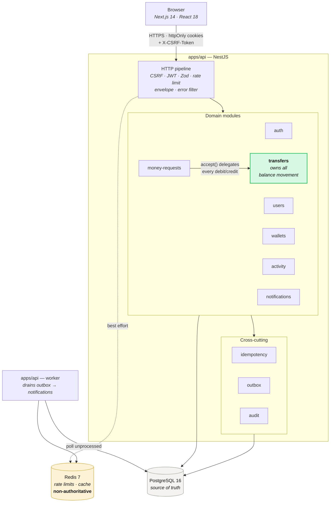
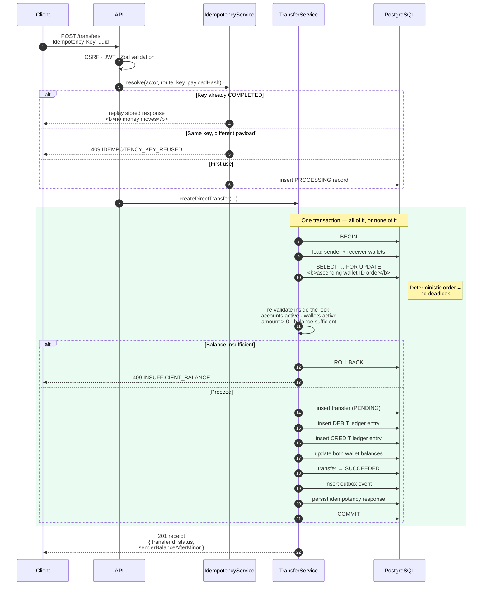
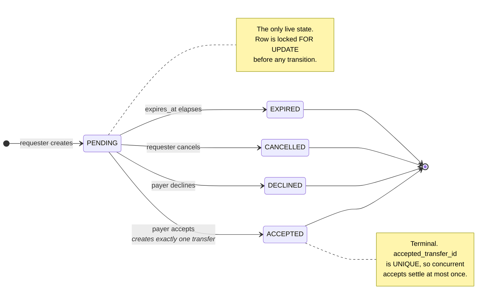
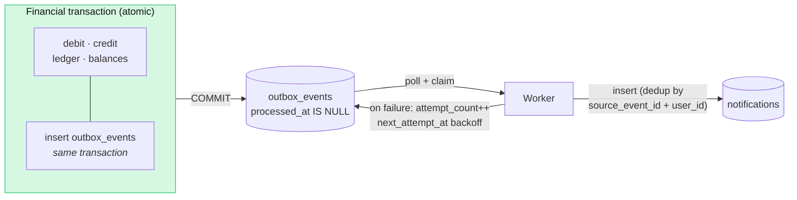

# Money Movement

A closed-loop, simulated-BDT money movement platform built the way a real
payments system is built: every balance change is atomic, retry-safe, and
backed by an append-only double-entry ledger.

Users register, get a BDT wallet, find each other by name or email, send money
directly, and request money from one another. Nothing here touches real funds.

**Product requirements:** [PRD.md](PRD.md) ·
**Build plan:** [IMPLEMENTATION_GUIDE.md](IMPLEMENTATION_GUIDE.md) ·
**Setup walkthrough:** [SETUP.md](SETUP.md)

---

## Contents

- [What makes this different](#what-makes-this-different)
- [System architecture](#system-architecture)
- [Data model](#data-model)
- [How a transfer works](#how-a-transfer-works)
- [Money requests](#money-requests)
- [Asynchronous side effects](#asynchronous-side-effects)
- [Quick start](#quick-start)
- [API reference](#api-reference)
- [Project layout](#project-layout)
- [Testing](#testing)
- [Scripts](#scripts)
- [Configuration](#configuration)

---

## What makes this different

Most wallet demos read a balance, do arithmetic in application code, and write
it back. That loses money under concurrency. This one does not.

| Concern | How it is handled |
| --- | --- |
| **Precision** | Money is `BIGINT` integer minor units (poisha) everywhere — DB, DTOs, UI. `৳2,500.00` is `250000`. No float or decimal ever enters the money path. |
| **Atomicity** | Debit, credit, ledger rows, and status flip all commit in one PostgreSQL transaction. Partial transfers are impossible. |
| **Concurrency** | Both wallets are locked `SELECT … FOR UPDATE` in ascending wallet-ID order, so concurrent transfers serialize instead of deadlocking or overspending. |
| **Retry safety** | Every money-moving write carries an `Idempotency-Key`. A retry replays the stored response byte-for-byte instead of moving money twice. |
| **Auditability** | Every successful transfer writes exactly one DEBIT and one CREDIT whose signed amounts sum to zero. Ledger rows are never updated or deleted. |
| **Availability** | Notifications go through a transactional outbox. A transfer succeeds even if Redis and the worker are both down. |
| **Scale** | Cursor (keyset) pagination on every list endpoint. No `OFFSET` anywhere. |

---

## System architecture

Domain-oriented **modular monolith** — one codebase, strict module boundaries,
two runtime entrypoints. Rationale in
[docs/ADR-001-modular-monolith.md](docs/ADR-001-modular-monolith.md).



**Two processes, one codebase.** `src/main.ts` serves HTTP; `src/worker.ts`
runs the outbox drain with no HTTP listener. They share modules and config but
scale and fail independently.

**Redis is never authoritative.** It backs rate limiting and caching only. If
it goes down, money still moves correctly.

---

## Data model

Ten tables. Money lives in `wallets.balance_minor`; the audit trail lives in
`ledger_entries`, and the two must always agree.

```mermaid
erDiagram
    USERS ||--o| WALLETS : "owns one"
    USERS ||--o{ AUTH_SESSIONS : "signs in via"
    USERS ||--o{ TRANSFERS : "sends / receives"
    USERS ||--o{ MONEY_REQUESTS : "requests / owes"
    USERS ||--o{ NOTIFICATIONS : "receives"
    USERS ||--o{ IDEMPOTENCY_RECORDS : "acts under"
    USERS ||--o{ AUDIT_EVENTS : "acted"

    WALLETS ||--o{ TRANSFERS : "debited / credited"
    WALLETS ||--o{ LEDGER_ENTRIES : "records"

    TRANSFERS ||--|{ LEDGER_ENTRIES : "exactly 1 DEBIT + 1 CREDIT"
    MONEY_REQUESTS |o--o| TRANSFERS : "settled by (on accept)"

    USERS {
        uuid id PK
        citext email UK "case-insensitive unique"
        string display_name
        string password_hash "argon2 — never returned"
        enum status "ACTIVE SUSPENDED CLOSED"
    }

    WALLETS {
        uuid id PK
        uuid user_id FK UK "one wallet per user"
        bigint balance_minor "poisha — never float"
        char currency "BDT"
        enum status "ACTIVE FROZEN CLOSED"
    }

    TRANSFERS {
        uuid id PK
        uuid sender_user_id FK
        uuid receiver_user_id FK
        bigint amount_minor "CHECK > 0"
        enum status "PENDING SUCCEEDED FAILED"
        enum source_type "DIRECT MONEY_REQUEST"
        uuid source_request_id FK "set when from a request"
        timestamp completed_at
    }

    LEDGER_ENTRIES {
        uuid id PK
        uuid transfer_id FK
        uuid wallet_id FK
        enum direction "DEBIT CREDIT"
        bigint signed_amount_minor "pair sums to zero"
        bigint balance_after_minor "snapshot under lock"
    }

    MONEY_REQUESTS {
        uuid id PK
        uuid requester_user_id FK
        uuid payer_user_id FK
        bigint amount_minor "CHECK > 0"
        enum status "PENDING ACCEPTED DECLINED CANCELLED EXPIRED"
        uuid accepted_transfer_id FK UK "one request per transfer"
        timestamp expires_at
    }

    IDEMPOTENCY_RECORDS {
        uuid id PK
        uuid actor_user_id FK
        string route_key "UK with actor + key"
        string idempotency_key
        char request_hash "SHA-256 of payload"
        enum state "PROCESSING COMPLETED FAILED"
        json response_body "replayed verbatim"
    }

    OUTBOX_EVENTS {
        uuid id PK
        string event_type
        json payload
        timestamp processed_at "NULL until drained"
        int attempt_count
        timestamp next_attempt_at "backoff gate"
    }

    NOTIFICATIONS {
        uuid id PK
        uuid user_id FK
        uuid source_event_id "UK with user — dedupes"
        string title
        timestamp read_at "NULL = unread"
    }

    AUDIT_EVENTS {
        uuid id PK
        uuid actor_user_id FK "NULL if unauthenticated"
        string action
        string request_id "correlation ID"
        json metadata "identifiers only — no secrets"
    }

    AUTH_SESSIONS {
        uuid id PK
        uuid user_id FK
        string refresh_token_hash UK "hash only"
        timestamp revoked_at
    }
```

### Key invariants

1. **`ledger_entries` is append-only.** No `UPDATE`, no `DELETE`, ever. A
   correction is a new compensating transfer.
2. **Every `SUCCEEDED` transfer has exactly two ledger rows** whose
   `signed_amount_minor` values sum to zero.
3. **Idempotency uniqueness is `(actor_user_id, route_key, idempotency_key)`**,
   stored in PostgreSQL — not Redis. Same key + different payload →
   `409 IDEMPOTENCY_KEY_REUSED`.
4. **`accepted_transfer_id` is `UNIQUE`**, so a request can be settled by at
   most one transfer even under concurrent accepts.
5. **Terminal states never transition again** — `SUCCEEDED`/`FAILED` for
   transfers, `ACCEPTED`/`DECLINED`/`CANCELLED`/`EXPIRED` for requests. Every
   mutation re-checks the pre-state inside the transaction.

---

## How a transfer works

`POST /api/v1/transfers` with an `Idempotency-Key` header. Everything between
`BEGIN` and `COMMIT` is one atomic unit.



**Why the balance is checked twice.** The client checks before submitting only
as a convenience. The authoritative check happens *inside* the row lock,
because the balance can change between the confirmation screen and the commit.

**Why lock order matters.** Two users paying each other simultaneously would
deadlock if each locked its own wallet first. Locking by ascending wallet ID
gives every code path the same global order, so one transaction simply waits.

---

## Money requests

Creating a request moves **no** money and touches **no** wallet. Only `accept`
does — and it delegates every debit and credit to the `transfers` domain rather
than reimplementing them.



**Accept sequence:** lock request row `FOR UPDATE` → verify actor is the payer
→ verify still `PENDING` and not expired → lock payer/requester wallets in
ascending ID order → re-check balance → create the linked transfer → write
ledger entries → update balances → mark transfer `SUCCEEDED` → set request
`ACCEPTED` + `accepted_transfer_id` → outbox event → persist idempotency
response → commit.

---

## Asynchronous side effects

Notifications must never be able to fail a payment. The outbox pattern
guarantees that.



Because the event is inserted in the **same** transaction as the money
movement, it commits atomically with it. If the worker is down, rows simply
accumulate unprocessed — a transfer still succeeds. Delivery is at-least-once,
so `(source_event_id, user_id)` is `UNIQUE`: reprocessing is a harmless no-op.

---

## Quick start

**Prerequisites:** Docker Desktop running, Node.js 20+.

```bash
cp .env.example .env
npm install

docker compose up -d postgres redis
npm run db:generate          # REQUIRED — Prisma types are generated, not committed
npm run db:migrate:deploy
```

Then in two terminals:

```bash
npm run start:dev --workspace @money-movement/api    # :4000
npm run dev       --workspace @money-movement/web    # :3000
```

Open **http://localhost:3000** — use `localhost`, not `127.0.0.1`, or the auth
cookies will not be treated as same-site.

To see a transfer you need two accounts: register one normally, register a
second in an incognito window, then send between them. Each new account is
seeded with ৳100,000.00.

### Or run everything in Docker

```bash
cp .env.example .env
docker compose up --build
```

Starts `postgres`, `redis` → `migrate` (applies migrations, exits) → `api`,
`worker` → `web`.

| Service | URL |
| --- | --- |
| Web | http://localhost:3000 |
| API | http://localhost:4000/api/v1 |
| Health | http://localhost:4000/api/v1/health |

Full walkthrough and troubleshooting: [SETUP.md](SETUP.md).

---

## API reference

Base path `/api/v1`. Auth is httpOnly cookies; state-changing routes need
`X-CSRF-Token` (double-submit), and money-moving routes additionally require
`Idempotency-Key: <uuid>`.

| Method | Route | Auth | Idem. | Purpose |
| --- | --- | :---: | :---: | --- |
| `GET` | `/health` | — | — | Liveness + DB reachability |
| `GET` | `/auth/csrf` | — | — | Issue CSRF cookie + token |
| `POST` | `/auth/register` | — | — | Create user + wallet, sign in |
| `POST` | `/auth/login` | — | — | Sign in |
| `POST` | `/auth/refresh` | cookie | — | Rotate access token |
| `POST` | `/auth/logout` | cookie | — | Revoke session |
| `GET` | `/users/me` | ✓ | — | Current profile |
| `GET` | `/users/search` | ✓ | — | Find recipients (cursor, rate-limited) |
| `GET` | `/wallet` | ✓ | — | Own balance |
| `POST` | `/transfers` | ✓ | **✓** | Send money |
| `GET` | `/transfers/:id` | ✓ | — | Receipt (participants only) |
| `POST` | `/money-requests` | ✓ | **✓** | Create request (moves no money) |
| `GET` | `/money-requests/incoming` | ✓ | — | Requests awaiting you (cursor) |
| `GET` | `/money-requests/outgoing` | ✓ | — | Requests you sent (cursor) |
| `GET` | `/money-requests/:id` | ✓ | — | One request (participants only) |
| `POST` | `/money-requests/:id/accept` | ✓ | **✓** | Pay it — creates one transfer |
| `POST` | `/money-requests/:id/decline` | ✓ | **✓** | Payer refuses |
| `POST` | `/money-requests/:id/cancel` | ✓ | **✓** | Requester withdraws |
| `GET` | `/activity` | ✓ | — | Unified timeline (cursor) |
| `GET` | `/notifications` | ✓ | — | Notifications (cursor, `unreadOnly`) |
| `POST` | `/notifications/:id/read` | ✓ | — | Mark read (naturally idempotent) |

### Envelopes

```jsonc
// Success
{ "data": { }, "meta": { "nextCursor": "…" }, "requestId": "uuid" }

// Error — stack traces are never leaked
{ "error": { "code": "INSUFFICIENT_BALANCE", "message": "…" }, "requestId": "uuid" }
```

### Error codes

| HTTP | Codes |
| ---: | --- |
| 400 | `VALIDATION_ERROR` |
| 401 | `UNAUTHENTICATED` |
| 403 | `FORBIDDEN` |
| 404 | `USER_NOT_FOUND` · `TRANSFER_NOT_FOUND` · `MONEY_REQUEST_NOT_FOUND` · `NOT_FOUND` |
| 409 | `INSUFFICIENT_BALANCE` · `REQUEST_ALREADY_RESOLVED` · `IDEMPOTENCY_KEY_REUSED` · `WALLET_UNAVAILABLE` |
| 422 | `INVALID_TRANSFER` |
| 429 | `RATE_LIMITED` |
| 500 | `INTERNAL_ERROR` |
| 503 | `SERVICE_UNAVAILABLE` |

---

## Project layout

```
apps/
  api/                        NestJS — HTTP server + worker
    src/
      auth/                   register · login · refresh · sessions
      users/                  profile · masked search
      wallets/                balance reads
      transfers/              ← owns ALL balance movement
      money-requests/         lifecycle; delegates to transfers on accept
      activity/               unified cursor-paginated timeline
      notifications/          read model + mark-read
      idempotency/            durable retry safety
      outbox/                 transactional event queue
      audit/                  append-only action trail
      security/               headers · account status
      common/                 guards · pipes · filters · pagination
      main.ts                 HTTP entrypoint
      worker.ts               outbox drain entrypoint
    test/integration/         Testcontainers suites

  web/                        Next.js App Router
    app/(auth)/               login · register
    app/(app)/                dashboard · send · requests · activity · notifications
    components/               Button · Field · Feedback · BalanceCard · …
    lib/                      api client · money · session context

database/prisma/              schema.prisma + migrations (schema source of truth)
docs/                         ADRs
```

### Module ownership

| Concern | Owner |
| --- | --- |
| Balance movement | `transfers/` — **only** module allowed to write balances or ledger rows |
| Request lifecycle | `money-requests/` — calls into `transfers/` on accept |
| Async side effects | `outbox/` + `notifications/` |
| Retry safety | `idempotency/` |
| Read-only history | `activity/` |

---

## Testing

```bash
npm test                                       # unit + API (Jest)
npm run test:integration --workspace apps/api  # real Postgres via Testcontainers
```

Integration suites cover auth, user search, transfers, money requests, activity,
outbox → notifications, and security/audit — each against an ephemeral
PostgreSQL container, not a mock.

The named acceptance proofs (IMPLEMENTATION_GUIDE.md §5.2):

| | Proof |
| --- | --- |
| **AC-1** | No partial transfer — failure mid-flight leaves zero trace |
| **AC-2** | Idempotent retry produces exactly one effect |
| **AC-3** | Concurrent sends cannot overspend a balance |
| **AC-4** | A request is accepted at most once under concurrency |
| **AC-5** | Authorization boundary — no cross-user reads or actions |
| **AC-6** | Ledger balances: every transfer's entries sum to zero |
| **AC-7** | Notification failure never fails a transfer |

CI runs format check → lint → typecheck → migration validation → unit tests →
integration tests on every push and PR ([ci.yml](.github/workflows/ci.yml)).

---

## Scripts

Run from the repository root.

| Command | Description |
| --- | --- |
| `npm run db:generate` | Generate the Prisma client (**required before first build**) |
| `npm run db:migrate:dev` | Create and apply a migration in development |
| `npm run db:migrate:deploy` | Apply pending migrations (CI/production) |
| `npm run typecheck` | `tsc --noEmit` across all workspaces |
| `npm run lint` / `lint:fix` | ESLint across all workspaces |
| `npm run format:check` / `format` | Prettier check / write |
| `npm test` | Unit + API tests |
| `npm run build` | Production build across all workspaces |

---

## Configuration

All variables live in `.env` at the repository root — see
[.env.example](.env.example) for the annotated list. The API validates its
environment at boot with Zod (`apps/api/src/config/env.schema.ts`) and **fails
fast** rather than starting misconfigured.

| Variable | Purpose |
| --- | --- |
| `DATABASE_URL` | PostgreSQL connection string |
| `REDIS_URL` | Redis connection string |
| `JWT_ACCESS_SECRET` | Access-token signing key — no default, required |
| `JWT_ACCESS_TTL_SECONDS` | Access-token lifetime (default 900) |
| `REFRESH_TOKEN_TTL_DAYS` | Refresh-token lifetime (default 7) |
| `INITIAL_WALLET_BALANCE_MINOR` | Seed balance in poisha (default 10000000 = ৳100,000) |
| `CORS_ORIGINS` | Comma-separated allowed browser origins |
| `NEXT_PUBLIC_API_BASE_URL` | API base URL the browser calls |

### Security posture

- Passwords hashed with Argon2; never logged, never returned.
- Refresh tokens stored **hashed**; the raw value lives only in an httpOnly
  cookie. No token is ever written to `localStorage` or `sessionStorage`.
- Double-submit CSRF on every state-changing route.
- Search returns **masked** emails only, and never another user's balance.
- Audit metadata carries identifiers and safe scalars only — no secrets, no
  note contents.

---

## License

See [LICENSE](LICENSE).
