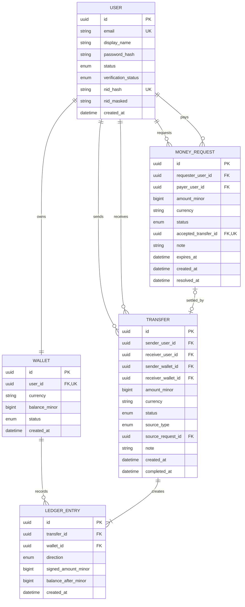
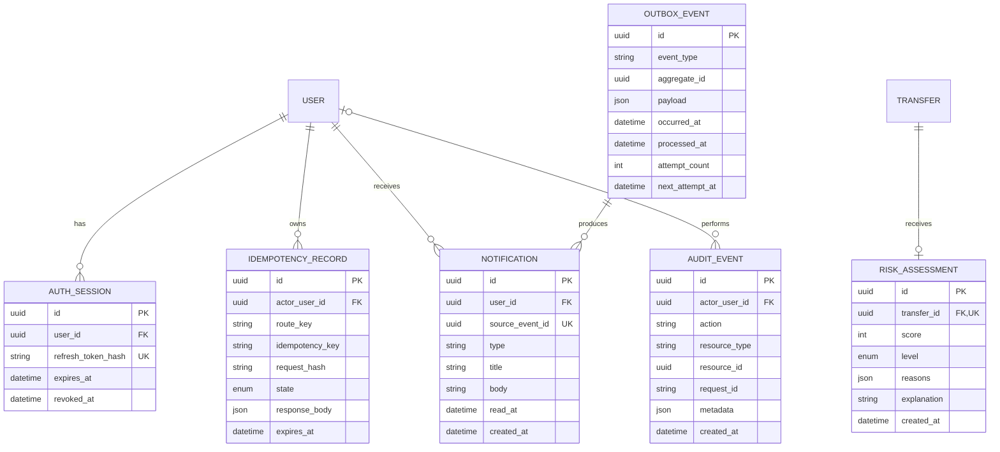

# Simplified Database Schema

This document is the simple, logical view of the Money Movement database.
The executable source of truth remains `database/prisma/schema.prisma` and its
migrations.

## Core banking data

## Supporting data

## What each table is for

| Table                 | Purpose                                                                  |
| --------------------- | ------------------------------------------------------------------------ |
| `users`               | Account identity, login details, status and simplified NID verification. |
| `wallets`             | One BDT wallet and current balance for each user.                        |
| `transfers`           | One money movement from a sender to a receiver.                          |
| `ledger_entries`      | Immutable debit and credit records for each completed transfer.          |
| `money_requests`      | Requests that can be accepted, declined, cancelled or expired.           |
| `auth_sessions`       | Hashed refresh tokens and session revocation state.                      |
| `idempotency_records` | Prevents a retried request from moving money twice.                      |
| `outbox_events`       | Reliable events waiting for the background worker.                       |
| `notifications`       | In-app messages created from processed events.                           |
| `audit_events`        | Trace of important security and financial actions.                       |
| `risk_assessments`    | One deterministic risk result for a transfer.                            |

## Important rules

1. Every user has at most one wallet.
2. Money is stored as integer poisha in `BIGINT`, never floating point.
3. The currency is fixed to `BDT` for this project.
4. Wallet balances cannot become negative.
5. A sender and receiver cannot be the same user.
6. Every successful transfer creates one debit and one matching credit.
7. Ledger entries are append-only and must not be edited or deleted.
8. A money request can be settled by at most one transfer.
9. An idempotency key can create only one effect for a route and user.
10. A worker retry cannot create the same notification twice.
11. Raw NID numbers and raw refresh tokens are never stored.

## Deliberately not separate tables

- **Activity:** derived from transfers and money requests.
- **Verification:** stored as a few fields on the user record.
- **Balance history:** represented by immutable ledger entries.
- **Transfer source:** stored on the transfer and linked to a money request when needed.
